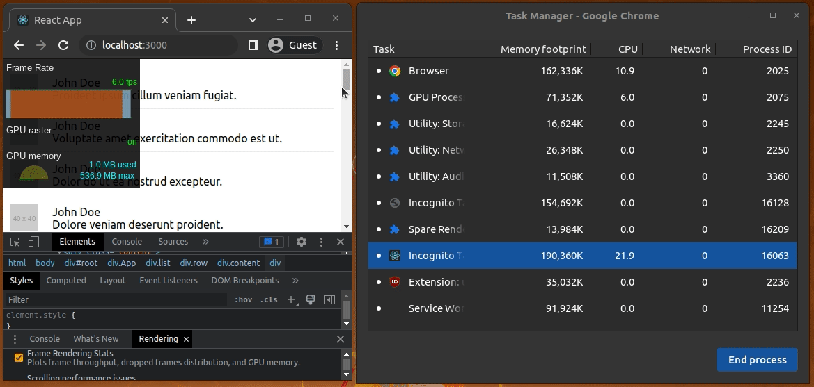

# react-large-list-demo

Rendering a large list in React directly without virtualization

## How to run the project

Download (or clone) the project, install dependencies and run the project:
```bash
npm install
# --- or ---
yarn install

npm start
# --- or ---
yarn start
```

## Measure rendering performance

Test the rendering performance issues as follows with Chrome DevTools:

1. Open the Developer tools panel.
2. Press Command+Shift+P (Mac) or Control+Shift+P (Windows, Linux) to open the Command Menu.
3. Start typing Rendering in the Command Menu and select Show Rendering.
4. In the Rendering tab, enable FPS Meter.
5. Scroll through the list one more time.



You'll notice a slow framerate (less than 60fps) and even a visible delay during initial rendering and scrolling events.

## Credits

This project was created based on [this LogRocket article](https://blog.logrocket.com/rendering-large-lists-with-react-virtualized-82741907a6b3/).
Credit goes to the original article's author, [Esteban Herrera](https://blog.logrocket.com/author/ehrrera/).

## License
[MIT](LICENSE)

